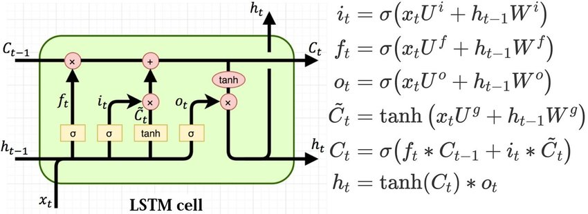

# Performance-driven-LSTM-Accelerator-Hardware

A compact, synthesizable **LSTM unit** built from 8-element × 8-bit fixed-point vectors.  
Gate pre-activations are computed with a fast **distributed-arithmetic** MVM (`mvm_proposed`).  
Nonlinearities (σ / tanh) are **ROM/LUT-based**. The repo includes clean testbenches
 for MVM units and the LSTM Cell. 
 Used: **ModelSim/Questa** (simulation) and **Quartus** (synthesis).

---

## 1) What this project implements

A single “unit” LSTM step with 8-element inputs. For each time step:

- **Gates**
  - `f = σ(Uf·ht₋₁ + Wf·xt)`
  - `i = σ(Ui·ht₋₁ + Wi·xt)`
  - `g = tanh(Ug·ht₋₁ + Wg·xt)`
  - `o = σ(Uo·ht₋₁ + Wo·xt)`
- **State / Output**
  - `ct = f ⊙ ct₋₁ + i ⊙ g`
  - `ht = o ⊙ tanh(ct)`
  
**Data width & packing**
- Element width **N = 8** bits, vector length **S = 8** elements → packed into **64-bit** buses.
- Packed bus slicing convention:
  - *Element `i`* is `bus[(i+1)*N-1 -: N]` (i.e., **element 0 lives in LSB slice** `[7:0]`).

**Latency (typical)**
- `mvm_proposed`: 1 cycle (registered inputs).
- `SigAddSub + Sigmoid/Tanh`: +1 cycle.
- `cellState`: +1 cycle.
- **Total** ≈ **2–3 cycles** from `xt/ht1/ct1` valid to `ht/ct` valid.

---

## 2) Modules — what they do?

### `mvm_proposed.sv`
- **What:** Saturating dot product using **distributed arithmetic** over pairs of weights.
- **Params:** `N=8`, `S=8` (**S must be even**).
- **I/O:**  
  - `w,u : logic [S*N-1:0]` packed vectors.  
  - `v   : logic [N-1:0]` 8-bit saturated result.
- **Timing:** input vectors are **registered**; accumulation is combinational → 1-cycle to `v`.

### `LSTMCell_proposed.sv`
- **What:** Orchestrates 8× `mvm_proposed` for the gate pre-activations, runs add+activation,
  then updates `(ct, ht)` in `cellState`.
- **I/O:**  
  - `xt, ht1 : [63:0]` (packed 8×8b).  
  - `ct1, ht, ct : [7:0]` (scalars).
- **Weights:** Pulled from `iniValues_ROM` instances (8 entries total → Ui/Uf/Uo/Ug/Wi/Wf/Wo/Wg).

### `SigAddSub.sv`
- **What:** A clocked pre-activation stage. It either computes `a+b` (based on a threshold)
  **or** `|a-b|`, then applies the **Sigmoid** block.
- **Output:** 8-bit.

> In vanilla LSTMs, pre-activations are sums. Keeping the “abs diff” path makes this block reusable,
> but for exact LSTM math you can drive it such that `a+b` is always chosen.

### `Sigmoid.sv`
- **What:** 9-bit input → 8-bit output via **piecewise** mapping:
  - `< 192` → output `32`  
  - `> 320` → output `96`  
  - `192..320` → `lut[input-192]` (128 entries, slowly rising 32→96)
- **Implication:** If your pre-activation rarely lands in 192..320, you’ll mostly see `32`.

**Tip:** For testing, **bias/scale** pre-activations so they spend time in 192..320.
Or adjust the thresholds/LUT to match your fixed-point scaling.

### `Tanh_ROM.sv`
- **What:** ROM lookup versions of tanh.

### `cellState.sv`
- **What:** Computes `ct = f*ct1 + i*cand` and `ht = o * activation(ct)`.
- **Note:** In the provided version, `ct` is assigned the **pre-activation sum** (not passed through tanh),
  while `ht` uses the nonlinearity. This is intentional in the code.

### `iniValues_ROM.sv`
- **What:** Tiny **8×64-bit ROM** for weight vectors.

---

## Resource & Performance (Quartus Flow Summary)

**Target board/device:** Terasic **DE1-SoC** (Intel **Cyclone V SoC 5CSEMA5F31C6**).  
Numbers are taken from the project report’s flow summaries (same synthesis settings).

### Matrix–Vector Multiply (MVM) — Multiplier vs. Distributed Arithmetic

| Metric | Standard MVM (multiplier-based) | Custom MVM (DA) | Δ (abs) | Δ (%) |
|---|---:|---:|---:|---:|
| **DSP blocks** | 8 | **0** | −8 | **−100%** |
| **ALMs** | 136 | **284** | +148 | **+108.8%** |
| **Area (report metric)** | 736 | **284** | −452 | **−61.4%** |

**Area reduction factor:** 736 / 284 ≈ **2.59×**.

---

### LSTM Cell — Standard vs. Custom (built from 8× custom MVMs)

| Metric | Standard LSTM | Custom LSTM | Δ (abs) | Δ (%) |
|---|---:|---:|---:|---:|
| **DSP blocks** | 67 | **3** | −64 | **−95.5%** |
| **ALMs** | 810 | **667** | −143 | **−17.7%** |
| **Area (report metric)** | 5835 | **667** | −5168 | **−88.6%** |
| **Critical Fmax** | 39.64 MHz | **70.4 MHz** | +30.76 MHz | **+77.7%** |

> The custom MVM eliminates DSPs via distributed arithmetic. Although ALMs rise **inside** the MVM, the **overall LSTM** area drops sharply due to DSP removal, while Fmax increases.

---

## Testing & Verification — MVM Units

Below are the **trial logs (PASS)** and **waveforms** already included in the repo for both MVM implementations.

### Multiplier-based MVM (`mvm_normal_mul`)

**PASS log (randomized trials)**  
.png)

**Waveform**  
.png)

- The log shows randomized trials where `v_ref` (golden, saturated dot-product) matches `v_dut`.
- The waveform highlights `w_bus`, `u_bus`, `v_ref`, `v_dut`.

### Distributed-Arithmetic MVM (`mvm_proposed`)

**PASS log (randomized trials)**  
.png)

**Waveform**  
.png)

- The DA unit matches the saturated golden model across trials.
- The waveform shows the per-bit DA accumulation..

---

